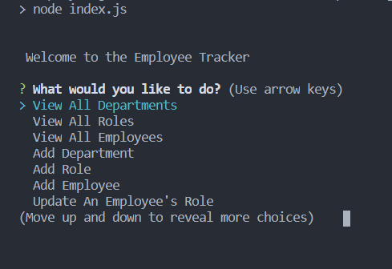

# Employee-Tracker

  ## Table of Contents
  * [Description](#description)
  * [Installation Instructions](#installation-instructions)
  * [Usage](#usage)
  * [Contribution Guidelines](#contribution-guidelines)
  * [Questions](#questions)
  
  ## Description
  This application helps you keep track of your company employees and managers!
  

  ## Installation Instructions
  Download the application from the GitHub repository here: https://github.com/geocode-matt/employee-tracker.

  Install node modules with 'npm install'

  ## Usage
  Type 'npm start' in the command line to initiate the application. Follow the prompts to work with your database of employees!

  Tutorial/Walkthrough Video:
  https://drive.google.com/file/d/14ZepGA8_C1nA3aoE39V_yUE3wkUipeq_/view
      
  ## Contribution Guidelines
  Please email the project owner (mlindenx@email.com) for contribution information. 

  ## Questions
  Please send any questions/concerns/comments to: mlindenx@gmail.com